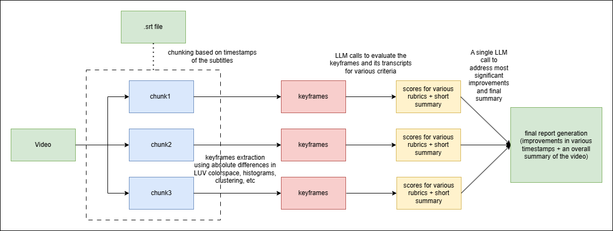

# MOOC Video Analyzer using Gemini
A python script that generates LLM based improvements and suggestions for a MOOC Video. Also, includes script for logo detection.
## Workflow of the System


The workflow is broken down into the following steps:
### 1. Transcript Modification:
In the first step, the transcripts are modified so that each chunk makes sense. So, [modify_transcripts.py](modify_transcripts.py) modifies the transcripts such that each text in a timestamp is a paragraph, instead of just parts of it.
### 2. Keyframe Extraction:
The script [frame_extract.py](frame_extract.py) inputs a video file from the folder along with its corresponding .srt transcript file. Based on the timestamps in the .srt file, the script divides the video into chunks, keeping track of its occurence time in the original video. Then, using multiple methods like histograms, absolute differences in LUV colorspace, etc using [Katna](https://katna.readthedocs.io/en/latest/#), the script extracts keyframes from these chunks.
### 3. LLM based Evaluation:
Once the video is organized into small manageable chunks and then extracted into keyframes, the transcript files and the keyframes are sent to the LLM(Gemini models) using the script [suggest.py](suggest.py) to evaluate each chunk on the following rubrics:
- Signaling (highlighting important information)
- Weeding (eliminating extraneous information)
- Matching Modality (auditory and visual sync)
- Visual quality (aesthetics and professionalism)
- Consistency
- Accessibility
- Technical Quality

Each of these rubrics are given one of the following scores by the LLM:
- Needs Attention : 1 point
- Meets Requirements : 2 points
- Exceeds Requirements : 3 points

A JSON file is obtained. Again, to address the most significant issues in the video quality, a final LLM call is done where the output JSON file is prompted, to generate a final report for the video. The final call will provide a JSON file which give improvements suggestions on the whole video in their appropriate timestamps.

### 4. Logo Detection:
To detect any presence of logo, the same chunks are utilized. The [logo_detection.py](logo_detection.py) uses an input logo which is provided to an LLM call, and similar to above, a JSON file is returned, which reveals the position of logo in the frames(if present).

## Usage
1. Install the packages:
```
pip install -r requirements.txt
```
2. Set up API keys for both OpenAI and Gemini in secrets.toml file:
```
OPENAI_API_KEY= "openai api key"
GEMINI_API_KEY= "gemini api key"
```
4. Run script [transcript_modify.py](transcript_modify.py) to modify the transcripts for our purpose:
```
python transcript_modify.py --input-folder $INPUT_FOLDER_FOR_LECTURES
```
5. Run script [frame_extract.py](frame_extract.py) to extract keyframes first:
```
python frame_extract.py --input_dir $INPUT_FOLDER_CONTAINING_VIDEOS --output_dir $OUTPUT_FOLDER_TO_SAVE_FRAMES --frames $NUMBER_OF_MAX_FRAMES_PER_CHUNK(DEFAULT = 5) 
```
6. Once done, run the script file [suggest.py](suggest.py) to generate the report:
```
python suggest.py --input_dir $INPUT_FOLDER_CONTAINING_FRAMES --output_dir $OUTPUT_FOLDER_FOR_REPORTS
```
7. For logo detection, place the logo inside the folder `logo` and run the script file [logo_detection.py](logo_detection.py):
```
python logo_detection.py
```
**Important**: Make sure that the video file and its transcript file has the same name.

The output is already stored as `combined_report_video_name.json` inside the subfolders in the [reports](reports) folder.
The output for logo detection is present in the [logo_reports](logo_reports) folder.